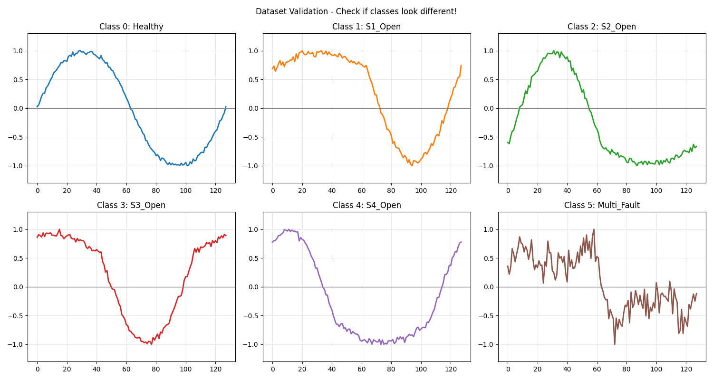
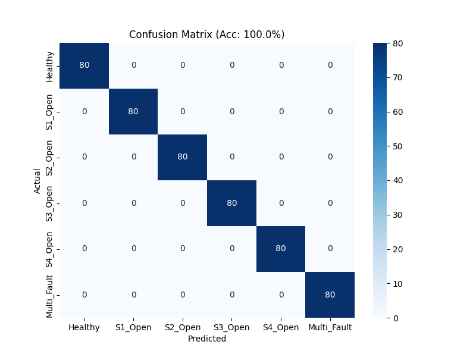

<p align="center">
  <a href="README.md">🇬🇧 English</a> | 
  <a href="README.id.md">🇮🇩 Bahasa Indonesia</a>
</p>

# ⚡ Lightweight CNN Fault Detector — ESP32-S3

**Deteksi Open-Circuit Fault pada Inverter Single-Phase menggunakan CNN 1D Ringan + TinyML**

> Bagian dari riset skripsi & Karya Tulis Ilmiah *"Demokratisasi AIoT untuk Keandalan Energi Terbarukan"* — Program Studi Teknik Elektro, Universitas Tanjungpura, Pontianak.

[]()
[]()
[]()
[]()

---

## 🎯 Ringkasan

Repo ini berisi pipeline machine learning untuk mendeteksi kerusakan **open-circuit fault (OCF)** pada inverter full-bridge satu-fasa, dirancang agar bisa berjalan langsung di mikrokontroler **ESP32-S3** (edge inference, tanpa bergantung cloud/GPU).

Pipeline mencakup:

```
Generate/Akuisisi Sinyal → Preprocessing → CNN 1D Training → Quantization INT8 → TFLite Micro → Deploy ke ESP32-S3
```

Target akhir: model < 200 KB, RAM < 100 KB, latensi inferensi < 500 ms, cocok untuk sistem PLTS residensial/UMKM yang tidak sanggup beli solusi monitoring komersial (Rp5–15 juta/unit).

---

## ⚠️ Status Proyek — Baca Sebelum Menilai Angka Apapun di Repo Ini

Repo ini berada di tahap **proof-of-concept / validasi kelayakan pipeline**, bukan sistem yang sudah divalidasi terhadap fault inverter nyata. Mohon perhatikan poin berikut:

| Komponen | Status | Catatan |
|---|---|---|
| Pipeline (generate → train → quantize → export) | ✅ Tervalidasi end-to-end | Berhasil dijalankan penuh, model ter-quantize siap format ESP32 |
| Dataset saat ini | 🧪 **Sintetis/toy** | Sinyal dibuat manual (scaling & phase-shift per kelas) untuk menguji pipeline, **bukan** hasil simulasi rangkaian fisik atau akuisisi hardware |
| Angka akurasi pada dataset toy | 🚫 Tidak representatif | Karena tiap kelas dibuat berbeda bentuk secara geometris, model mana pun cenderung mudah memisahkannya — angka ini **tidak mencerminkan** performa deteksi fault dunia nyata dan sengaja tidak dipublikasikan sebagai klaim hasil |
| Dataset fisik (Simulink / hardware lab) | 🔜 Rencana lanjutan | Lihat [Roadmap](#-roadmap) |

**Singkatnya:** yang sudah terbukti adalah *arsitektur & pipeline-nya jalan dan bisa di-deploy*. Yang belum terbukti adalah *kemampuan deteksi fault pada kondisi nyata* — itu baru akan diklaim setelah dataset fisik tersedia.

---

## 🏗️ Arsitektur

- **Model:** CNN 1D ringan (Conv1D → MaxPool → Conv1D → MaxPool → Conv1D → GAP → Dense → Softmax)
- **Input:** window sinyal arus, 128 sampel (setara 128 ms @ 1 kHz sampling)
- **Output:** 6 kelas — `Healthy`, `S1_Open`, `S2_Open`, `S3_Open`, `S4_Open`, `Multi_Fault`
- **Optimasi:** post-training quantization INT8 via representative dataset, target ukuran model < 200 KB
- **Target deployment:** ESP32-S3 (dual-core Xtensa LX7 @ 240 MHz), sensor arus ACS712, monitoring remote via Thinger.io

---

## 📊 Visualisasi (Dataset Toy)

**Validasi bentuk sinyal per kelas:**


**Confusion matrix hasil training pada dataset sintetis:**


> ⚠️ Akurasi 100% di atas adalah hasil pada dataset sintetis/toy, bukan indikator performa deteksi fault dunia nyata. Lihat bagian [Status Proyek](#️-status-proyek--baca-sebelum-menilai-angka-apapun-di-repo-ini).

---

## 📁 Struktur Repo

```
.
├── generate_dataset.py      # Generator sinyal sintetis (toy dataset, lihat disclaimer)
├── train_model.ipynb        # Training CNN 1D + evaluasi
├── quantize_export.py       # Konversi ke TFLite Micro INT8
├── dataset_output/
│   ├── X_data.npy
│   ├── y_data.npy
│   └── model_int8.tflite
├── figures/
│   ├── dataset_validation.png
│   └── confusion_matrix.png
└── README.md
```

---

## 🗺️ Roadmap

- [x] Pipeline generate → train → quantize → export (proof-of-concept)
- [ ] Simulasi inverter H-bridge berbasis fisika (MATLAB/Simulink) untuk dataset yang lebih representatif
- [ ] Akuisisi data lab: inverter full-bridge 500VA + ACS712 + injeksi OCF fisik pada IGBT
- [ ] Evaluasi ulang akurasi & F1-score pada dataset fisik/lab
- [ ] Deployment & pengujian real-time di ESP32-S3
- [ ] Integrasi Thinger.io untuk monitoring remote + failover offline

---

## 📄 Terkait

Repo ini menyertai Karya Tulis Ilmiah *"Demokratisasi AIoT untuk Keandalan Energi Terbarukan: Sistem Deteksi Kerusakan Inverter Berbasis CNN Ringan dan ESP32-S3"* — Kompetisi Karya Tulis Ilmiah Spesial Kemerdekaan PT Borneo Alumina Indonesia, Agustus 2026.

## 👤 Penulis

**Sharrif Faqih Fajarudin**
NIM D1021221062 — Program Studi Teknik Elektro, Fakultas Teknik, Universitas Tanjungpura, Pontianak

## 📜 Lisensi

MIT — bebas digunakan/dimodifikasi dengan atribusi.
